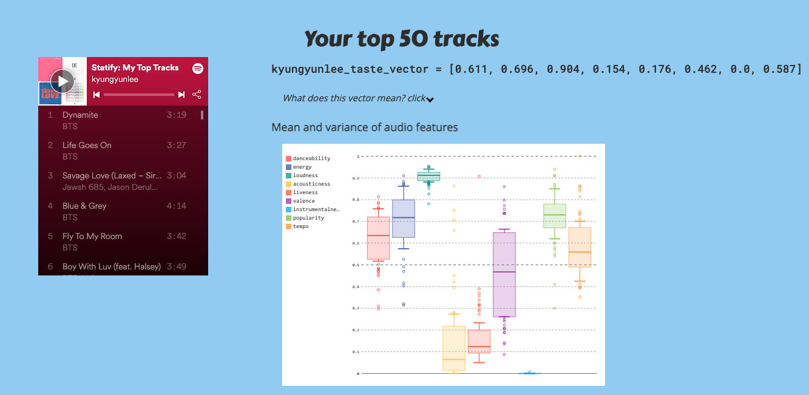
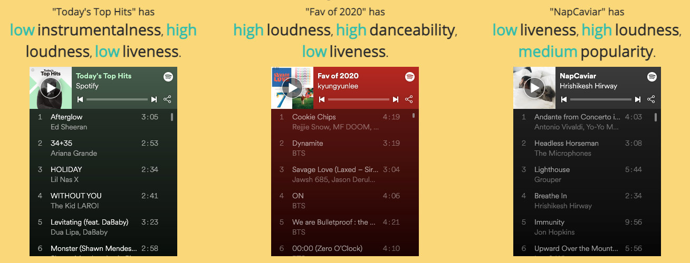
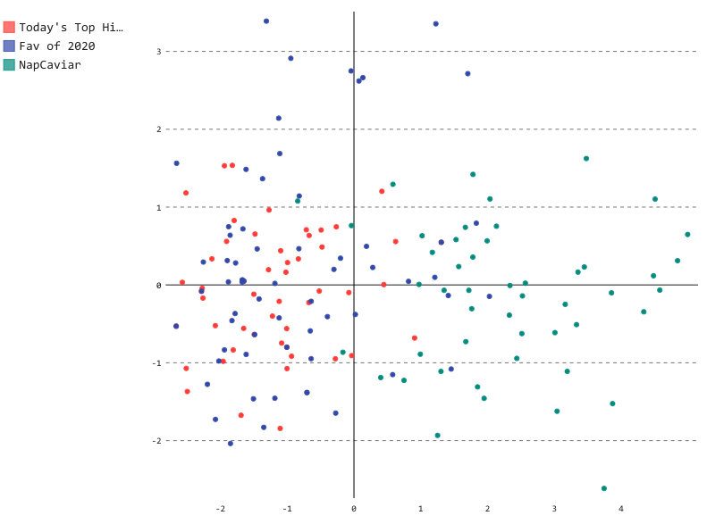

**NOTE: Heroku server may be sleeping. It might take a while to wake up** 
[Link to website](http://statify-with-spotify.herokuapp.com/)

[Link to slides](https://docs.google.com/presentation/d/1sauciCYPynbjw9WXYGy5iYJ5p2wUus6o_jZa1-otKWk/edit?usp=sharing)

[Link to conference video](https://www.youtube.com/watch?v=GXomyX0qNdI&list=PLcNrB7gPa-NcBgA385J1YGlg_iUAk7hAV&index=6)

This was presented at [PyCascades 2019](https://2019.pycascades.com/) in Seattle, WA, USA.

(This post was written in 2020)

#### What is it?

Statify analyzes your listening history and returns some basic statistics. My top tracks have high loundness, high energy and high danceability. Most of my tracks have vocals, so very low instrumentalness. 

<!-- 
 -->

Features used 

* Danceability: How danceable is the song?
* Energy
* Loudness
* Acousticness
* Liveliness: Is the song played live or recorded? 
* Valence: Happy or sad? 
* Instrumentalness: Does the song contain a lot of instruments or vocals? 
* Popularity
* Tempo

Also, you can see how different or similar your playlist is compared to other playlists. 

<!--  -->

Below is an embedding of tracks from both playlists. Each dot represents a track. If dots are closer together, it means those tracks are similar in terms of chosen audio features. 

Here you can see that "Today's Top Hit" and my playlist of "Fav of 2020" are quite similar (I listened to a lot of popular pop in 2020.) The green dots are "NapCaviar" playlist, consisting of calm and mellow nap time songs. So, you see they are in a quite distinct space. 

<!-- 
 -->

#### How?

[Spotify API](https://developer.spotify.com/documentation/web-api/) offers various pre-computed audio features, such as danceability, instrumentalness and acousticness, for each track. All I did was to retrieve these data and plot them! 

#### Website 

[Here is the link again](http://statify-with-spotify.herokuapp.com/)

p.s. Might be a bit slow on load, since Heroku keeps unvisited sites dormant after a while.

