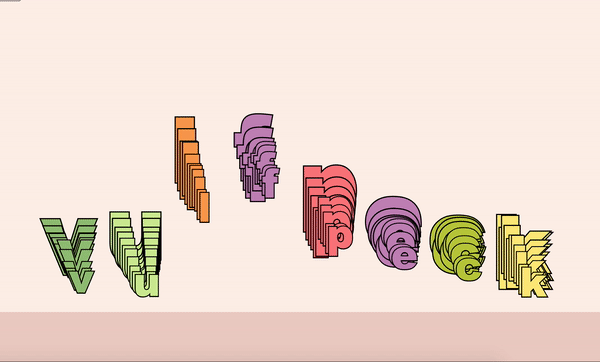

This is a music visualizer, which visualizes the frequency by dividing the range into the number of input letters.

You can type in any letter you want and play it with any song you want :D 

Live website is [here](https://kyungyunlee.github.io/ctp431/music_vis.html).

